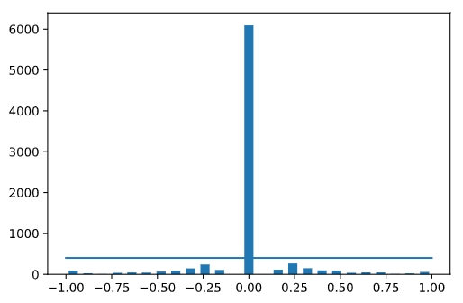
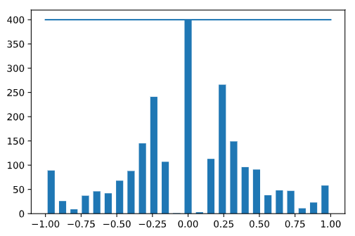
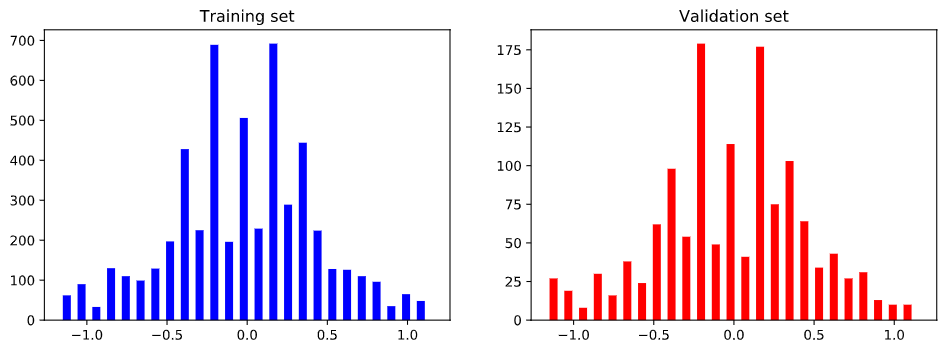
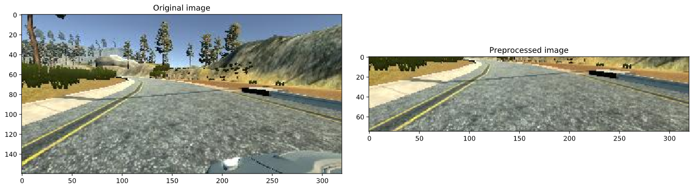
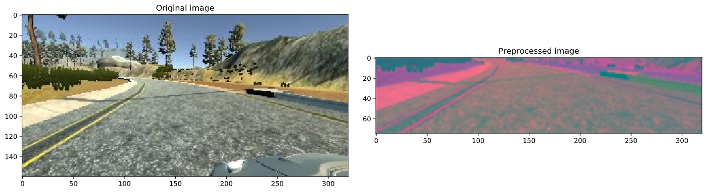
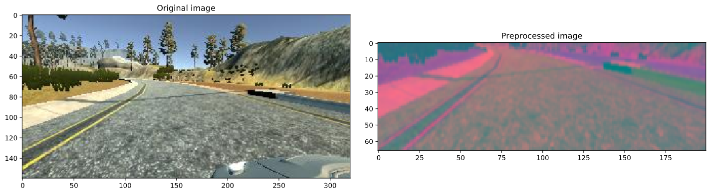

# behavioural-cloning
🤖 AI cloning the behavior of a driving simulator 🚗

## Balance data

Our data is skewed toward the middle:

Let's balance the data:

## Training & Validation Split

## Preprocess data

Crop the landscape and hood of the car:

Switch to YUV space:

Apply Gaussian Blur:

Resize: 

